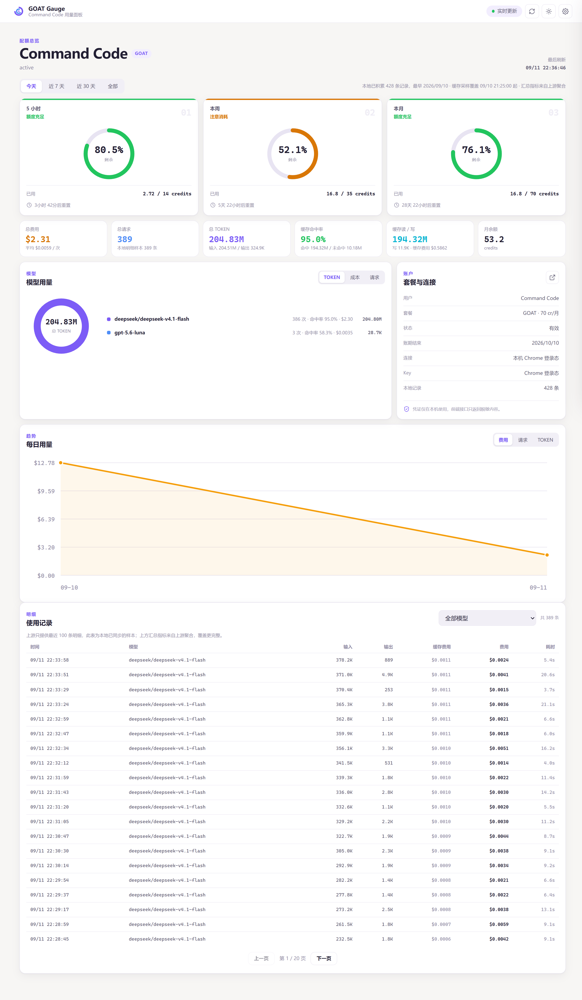
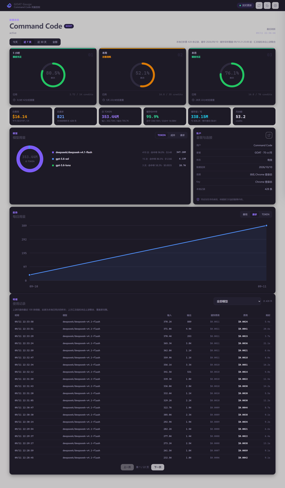
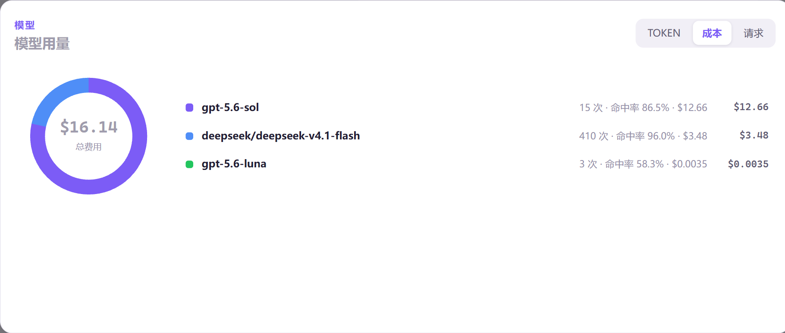
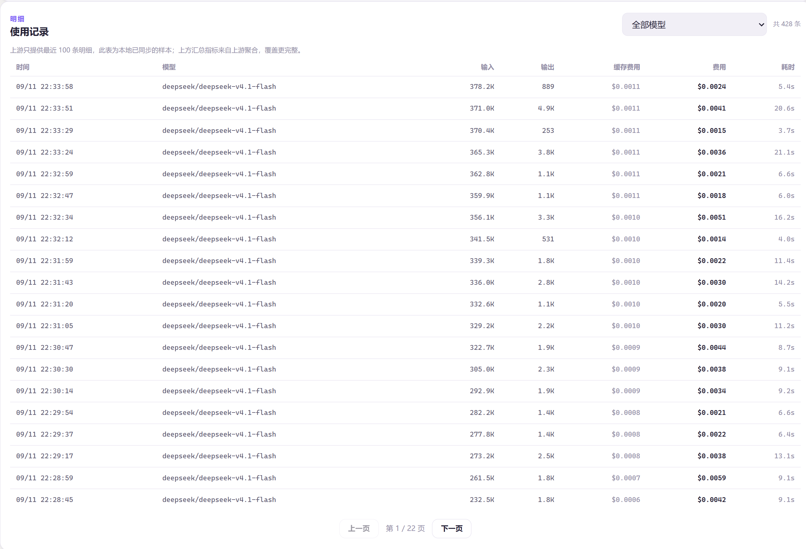

# GOAT Gauge

GOAT Gauge is a local-first usage dashboard for Command Code GOAT.

## Screenshots

| Dashboard (light) | Dashboard (dark) |
|:---:|:---:|
|  |  |

| Model usage by cost | Usage records |
|:---:|:---:|
|  |  |

---

It reads the same account and billing endpoints used by the Command Code CLI:

- `GET /alpha/whoami`
- `GET /alpha/billing/credits`
- `GET /alpha/billing/subscriptions`
- `GET /alpha/usage/summary`

The dashboard shows the rolling 5-hour, weekly, and monthly quota, reset
countdowns, credit balances, billing-period statistics, and a locally recorded
usage trend. It runs on `127.0.0.1`, stores history in SQLite, and stores a
saved API key with Windows DPAPI encryption.

It mirrors the GoGauge layout: quota rings, a time-range switch
(today / 7 days / 30 days / all), overview KPIs, a model-usage donut, a daily
trend chart, a paged usage-record table with per-request cost, plus cache hit
rate, cache read/write volume, and per-model hit rate.

## Run

Double-click `start_chrome.bat`, or run:

```powershell
python entry.py --chrome
```

The first run opens a dedicated Chrome profile at the Command Code sign-in
page. Sign in once in that window. GOAT Gauge then captures the authenticated
browser session through Chrome DevTools, keeps the session in memory, and
starts refreshing the dashboard automatically. The dashboard opens in the same
Chrome profile.

If you prefer not to use browser sign-in, the onboarding screen also accepts a
Command Code API key.

To run only the local server:

```powershell
python -m pip install -r requirements.txt
python entry.py --serve --port 18927
```

Then open `http://127.0.0.1:18927`.

Use `--demo` to preview the UI without an API key:

```powershell
python entry.py --chrome --demo
```

## Desktop shortcut

```powershell
powershell -ExecutionPolicy Bypass -File .\tools\make-shortcut.ps1
# 可选: 同时注册「登录后静默启动本地服务」
powershell -ExecutionPolicy Bypass -File .\tools\make-shortcut.ps1 -Startup
```

This creates a **GOAT Gauge (Chrome)** shortcut on the desktop together with
`assets/goat-gauge.ico`.

The shortcut targets a hidden `powershell.exe` running `launch.ps1` rather than
`cmd.exe`, which is what makes it behave well on the taskbar: no black console
flash on launch, and the shortcut keeps its own icon when pinned.

`launch.ps1` probes `http://127.0.0.1:18927` first, so clicking the shortcut
twice reuses the running server instead of starting a second copy.

To pin it: right-click the desktop shortcut, then **Pin to taskbar**
(on Windows 11 choose *Show more options* first).

### Why the Chrome window pins as "Google Chrome"

Chrome's `--app=` windows inherit Chrome's own taskbar identity, so pinning a
running window produces a **Google Chrome** entry. GOAT Gauge therefore ships a
web app manifest and service worker, which lets Chrome install it as a real
standalone app with its own name and icon.

In the dashboard, open **设置 → 安装为桌面应用**. Once installed, GOAT Gauge
appears in the Start menu and can be pinned to the taskbar with the purple icon
and its own window identity.

Because the installed app talks to `http://127.0.0.1:18927`, register the server
to start at login (`-Startup` above) if you want the pinned app to work right
after a reboot. The pinned app itself needs the local server running.

## Credential lookup

GOAT Gauge uses either a signed-in Chrome session or an API key. For a browser
session, the key is never handled manually. For API-key mode, it checks:

1. `COMMAND_CODE_API_KEY`
2. `COMMANDCODE_API_KEY`
3. The encrypted key saved by GOAT Gauge
4. Known values in `%USERPROFILE%\.commandcode\auth.json` or
   `%USERPROFILE%\.commandcode\config.json`

If no key or browser session is available, the interface asks for an API key.
It is validated before being saved. The key is never returned to the browser.

## Data

Runtime data defaults to `%LOCALAPPDATA%\GOATGauge`.

Set `GOATGAUGE_DATA` to use a portable data directory.

### Upstream limits

Command Code's usage endpoint only exposes the newest bounded window
(currently 1 day / 100 entries) and ignores range query parameters. GOAT Gauge
therefore keeps every record it has seen in local SQLite, and the
7-day / 30-day / all views are assembled from that local history. Those wider
ranges fill in as the app runs.

The same endpoint returns no session identifier, so per-session cost is not
available and is intentionally omitted rather than guessed.

### Cache metrics

Cache tokens come from `/internal/usage/charts`, which accepts an explicit
`from`/`to` window (roughly one day) and reports `cacheReadInputTokens` /
`cacheCreationInputTokens` per model and time bucket. GOAT Gauge stores those
buckets locally and computes:

- hit rate = cache read tokens / input tokens
- miss tokens = input tokens - cache read tokens

Aggregate KPIs prefer these upstream buckets because they cover the full
upstream window; the record table is a narrower sample (the newest ~100
entries), and the dashboard labels the difference.

GOAT Gauge uses Chrome DevTools port `9333` by default, so it can run
alongside other local tools that use port `9222`. Override it with
`GOATGAUGE_CHROME_CDP_PORT` if needed.

## Tests

```powershell
python -m unittest discover -s tests -v
```

This is an unofficial community project and is not affiliated with Command
Code or its operators.
